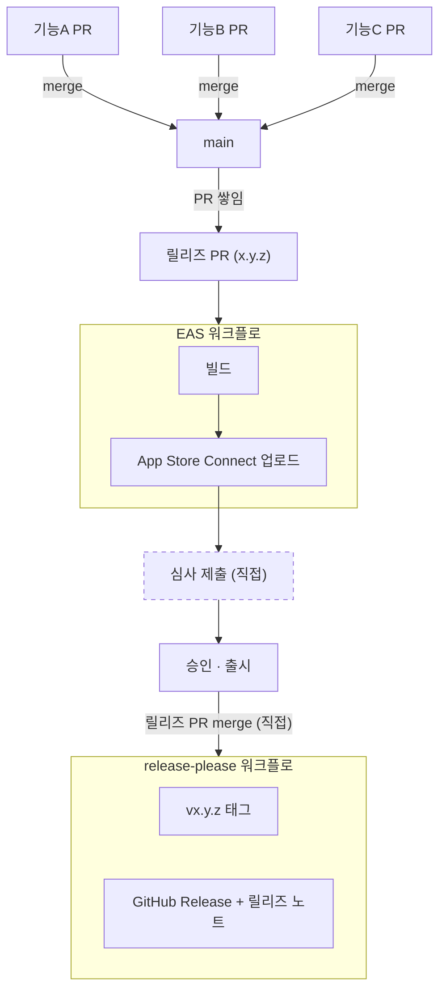

# 릴리즈 흐름(iOS 기준)

버전을 올리고 스토어 출시까지의 경로

## 전체 흐름



릴리즈 PR 브랜치에 버전을 올린 `package.json`이 있어 `--ref`로 릴리즈 PR 브랜치를 지정해 체크아웃 없이 EAS 워크플로를 실행한다.

```bash
pnpm release:ios
```

## 버전

`package.json`의 `version`을 유일한 출처로 둔다. `app.config.js`가 `package.json`의 `version`에서 버전을 읽어 Expo 설정에 넣는다.

- 커밋 타입이 버전을 결정
  - `!`가 붙으면 메이저
  - `feat`은 마이너
  - 나머지는 패치
- `main`의 버전은 마지막으로 출시된 버전
- 다음 버전은 릴리즈 PR 브랜치에 있음
- 사람이 버전 숫자를 적는 자리는 없음

빌드 번호(iOS `buildNumber`, Android `versionCode`)는 `appVersionSource: remote` 설정으로 EAS 서버에서 보관하고 `autoIncrement`로 빌드마다 자동으로 번호를 올린다.

## 관련 파일

| 파일                                   | 역할                                          |
| -------------------------------------- | --------------------------------------------- |
| `release-please-config.json`           | 릴리즈 노트 절 이름, 기준점, PR 제목          |
| `.release-please-manifest.json`        | release-please가 기록하는 현재 버전           |
| `.github/workflows/release-please.yml` | 릴리즈 PR 생성·갱신, 머지 시 태그·릴리즈 발행 |
| `.eas/workflows/release-ios.yml`       | 수동 실행으로 iOS 빌드와 제출                 |
