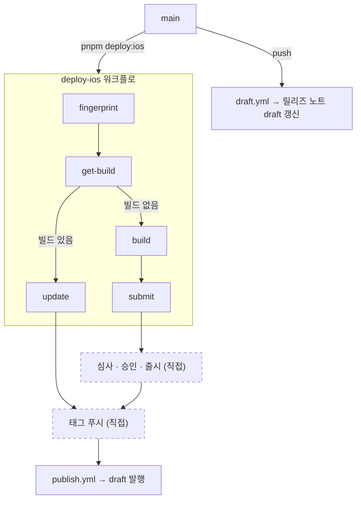

# 릴리즈 흐름(iOS 기준)

스토어 배포와 OTA 업데이트 흐름 및 릴리즈 노트 발행까지의 흐름

## 전체 흐름



## 배포 수단 판정

`fingerprint` 잡이 현재 커밋의 네이티브 fingerprint를 계산하고, `get-build` 잡이 같은 fingerprint로 만들어진 production 빌드가 EAS 서버에 있는지 조회한다.

- 찾으면 `eas update`로 JS 번들만 내보낸다
- 못 찾으면 빌드해서 App Store Connect에 올린다

fingerprint에는 네이티브 빌드를 결정하는 것만 들어간다. `src/` 아래 TypeScript는 들어가지 않아, 화면 로직만 고친 배포는 OTA로 나간다. 다음을 고치면 fingerprint가 바뀌어 스토어 빌드가 필요하다.

- 네이티브 코드가 있는 패키지의 추가·제거·버전 변경
- `app.json`의 `plugins`, `ios.infoPlist`
- `plugins/` 아래 config plugin
- 기본 fingerprint에 포함되지 않는 경우,`fingerprint.config.js`의 `extraSources`에 추가하여 네이티브 빌드로 진행

## 배포

```bash
pnpm deploy:ios
```

`--ref main`으로 항상 `main`을 기준으로 배포를 진행한다.

## 릴리즈 노트

`main`에 머지될 때마다 Release Drafter가 draft에 변경을 쌓는다.

태그 푸시로 자동 발행한다.

```bash
git tag v1.0.1.1 && git push origin v1.0.1.1
```

| 배포   | 태그       | 릴리즈 제목      | 푸시 시점      |
| ------ | ---------- | ---------------- | -------------- |
| OTA    | `v1.0.1.1` | 1.0.1 업데이트 1 | 배포 직후      |
| 스토어 | `v1.0.1`   | v1.0.1           | 승인·출시된 뒤 |

태그 형식이나 순번이 틀리면 `publish.yml`이 중단하고 올바른 태그를 알려준다.

## 버전

`package.json`의 `version`을 유일한 출처로 둔다. `app.config.js`가 읽어 Expo 설정에 넣는다.

- 스토어 배포 전 `package.json`의 `version`을 직접 올린다
- OTA 배포에서는 올리지 않는다

빌드 번호(iOS `buildNumber`)는 `appVersionSource: remote` 설정으로 EAS 서버가 보관하고 `autoIncrement`가 빌드마다 올린다.

## 관련 파일

| 파일                            | 역할                                   |
| ------------------------------- | -------------------------------------- |
| `.eas/workflows/deploy-ios.yml` | fingerprint로 배포 수단을 정해 실행    |
| `.github/workflows/draft.yml`   | `main` push마다 릴리즈 노트 draft 갱신 |
| `.github/release-drafter.yml`   | 절 이름과 분류 규칙                    |
| `.github/workflows/publish.yml` | 태그 푸시로 draft 발행                 |
| `fingerprint.config.js`         | fingerprint에 `targets/` 추가          |
