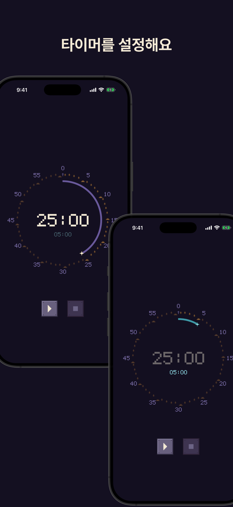
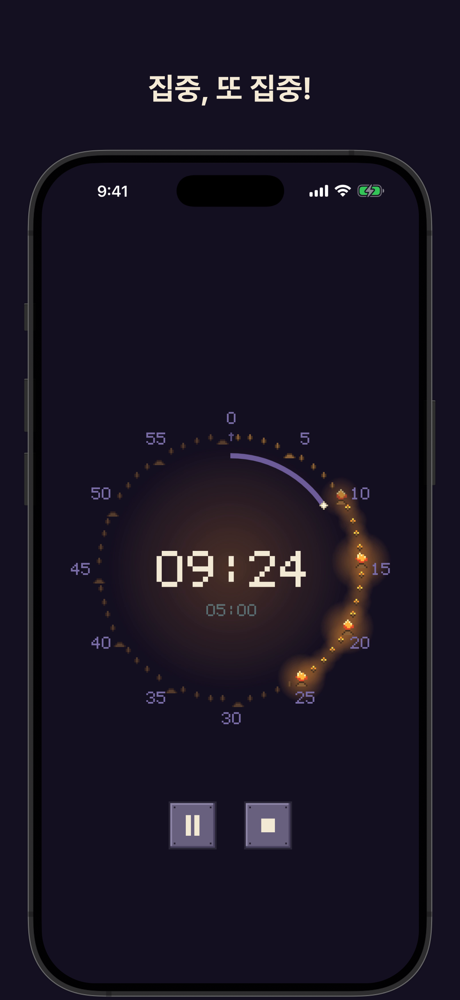
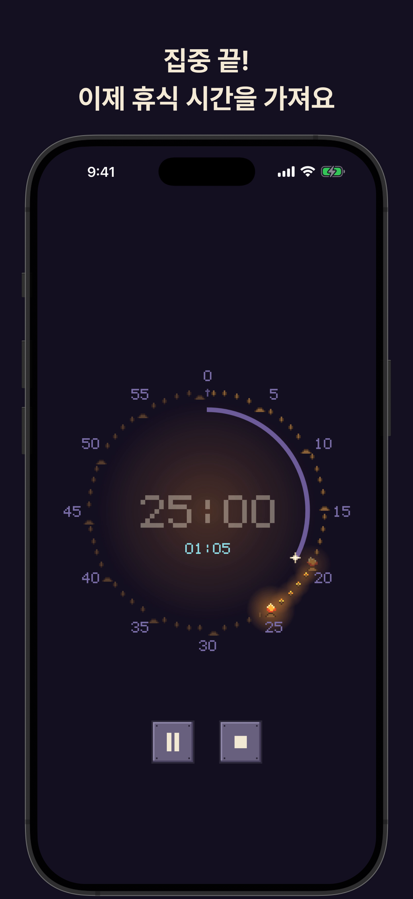
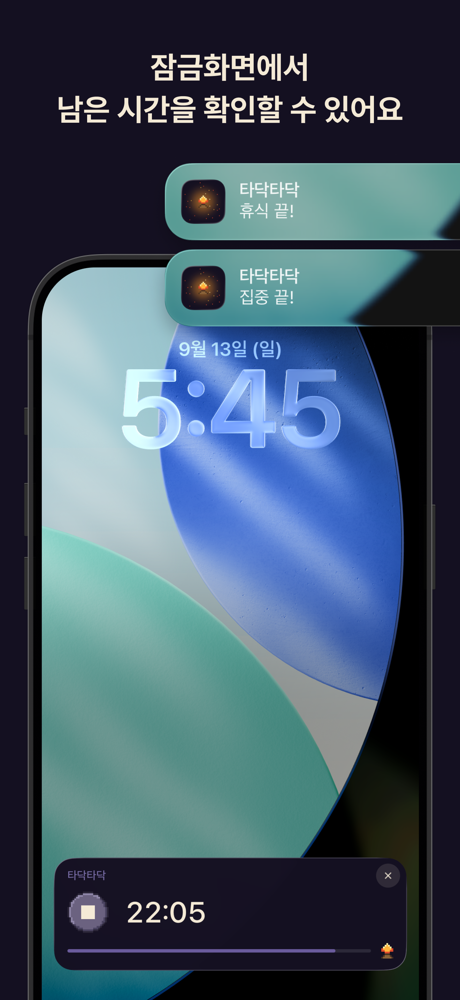

# 타닥타닥

집중할 땐 은은하게 밝아지고, 쉴 땐 차분하게 어두워져요.
집중할 시간과 휴식할 시간을 설정하고, 타이머를 시작하면 돼요.

<p>
  
  
  
  
</p>

## 실행

Node.js 22.23.2, pnpm 10 기준.

```bash
pnpm install
cp .env.example .env   # EXPO_APPLE_TEAM_ID 입력
pnpm ios               # iOS 시뮬레이터 개발 빌드
pnpm android           # Android 에뮬레이터 개발 빌드
```

## 배포

스토어 배포 시 `package.json`의 `version`을 직접 수정 후 `main`을 기준으로 다음 스크립트를 실행한다.

```bash
pnpm deploy:ios                   # fingerprint로 OTA와 스토어 배포를 구분해 실행
```

- fingerprint가 직전 빌드와 같으면 OTA로, 다르면 빌드해서 App Store Connect에 업로드

배포 후 태그 푸시를 통해 릴리즈 노트를 발행한다.

- OTA: 배포 직후
- 스토어: 승인·출시 후

```bash
git tag v1.0.1.1 && git push origin v1.0.1.1   # OTA
git tag v1.0.1 && git push origin v1.0.1       # 스토어
```

직접 빌드 시:

```bash
pnpm build:preview -p ios         # 등록된 기기에 설치하는 빌드
pnpm build:production -p ios      # 스토어 제출용 빌드
pnpm submit -p ios                # App Store Connect 제출
pnpm build:preview -p android
pnpm build:production -p android
```

## 시뮬레이터 언어

시스템 언어를 바꿔 현지화를 확인한다.

```bash
# 켜져 있는 시뮬레이터의 UDID
UDID=$(xcrun simctl list devices booted | grep -oE '[0-9A-F-]{36}')

# 언어 변경
xcrun simctl spawn $UDID defaults write -g AppleLanguages -array en-US ko-KR
xcrun simctl spawn $UDID defaults write -g AppleLocale -string en_US
xcrun simctl shutdown $UDID && xcrun simctl boot $UDID
```

- 한국어: AppleLanguages `ko-KR en-US`, AppleLocale `ko_KR`로 적용
- 시뮬레이터 재부팅 필요

## 스택

| 항목       | 값                                                             |
| ---------- | -------------------------------------------------------------- |
| 프레임워크 | Expo SDK 57, React Native 0.86                                 |
| 렌더링     | `@shopify/react-native-skia`, `react-native-reanimated`        |
| 위젯       | SwiftUI Widget Extension (`targets/`), `@bacons/apple-targets` |
| 아키텍처   | Feature-Sliced Design                                          |
| 빌드·배포  | EAS Build, EAS Submit, EAS Update                              |
