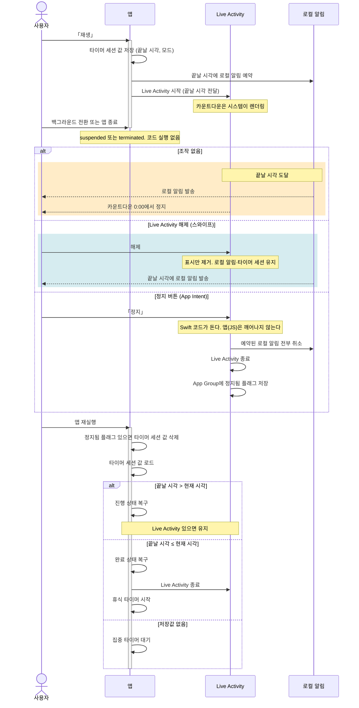

# 타닥타닥 구현 명세

화면에 보이지 않는 동작을 담는다. 만드는 과정은 `PLAN.md`에 있다.

## 용어

- **타이머 세션**: 집중 타이머 한 번과 이어지는 휴식 타이머 한 번. 휴식 타이머가 `00:00`이면 집중 타이머 하나가 타이머 세션이다
- **타이머 세션 값**: 타이머 세션이 도는 동안 저장하는 값. 지금 도는 타이머의 끝날 시각, 현재 모드, 일시정지 시 남은 밀리초. 휴식 타이머가 시작되면 휴식 값으로 바뀐다

## 전체 흐름

- 집중 타이머 시작부터 앱을 백그라운드 및 종료 후 다시 켤 때까지의 전체 흐름
- 앱이 처리하는 영역과 iOS가 처리하는 영역을 분리해 그렸다
- Live Activity에서 지원하는 기능(정지 버튼, 스와이프 해제)을 포함한다

## 시간 모델

### 남은 시간

- 시작할 때 끝날 시각을 `지금 시각 + 설정 시간`으로 잡는다
- 진행 중에는 매 프레임 `설정 시간 − 시작 후 흐른 시간`으로 남은 시간을 새로 구한다. 흐른 시간은 기기 가동 시간(`performance.now`)으로 잰다. 이전 프레임 값을 이어받지 않는다
- 계산은 UI 스레드에서 한다. `react-native-reanimated`의 `useFrameCallback`이 프레임마다 남은 시간을 shared value에 쓴다
- 호, 손잡이 각도, 켜진 개체, 차오름 진행률은 그 값을 UI 스레드에서 읽는다
- 숫자는 남은 초가 바뀔 때 `scheduleOnRN`으로 JS 스레드에 넘겨 다시 그린다. 도트 격자가 글자마다 달라 UI 스레드에서 바꿀 수 없다. 완료 같은 상태 전이도 같은 방식으로 넘긴다
- 포그라운드로 돌아오거나 앱을 다시 켜면 첫 프레임을 그리기 전에 `끝날 시각 − 지금 시각`으로 남은 시간을 한 번 다시 맞춘다

### 기기에 저장하는 값

앱을 껐다 켜도 남도록 기기 저장소(`@react-native-async-storage/async-storage`)에 둔다. 앱 재실행 때 이 값으로 복구한다.

| 값                             | 저장 시점                  | 삭제 시점                            |
| ------------------------------ | -------------------------- | ------------------------------------ |
| 단계 (대기·진행·일시정지·완료) | 시작, 일시정지, 재개, 완료 | 정지                                 |
| 끝날 시각                      | 시작, 재개                 | 일시정지, 완료, 정지                 |
| 시작한 시각                    | 시작                       | 완료, 정지                           |
| 현재 모드 (집중·휴식)          | 시작                       | 정지                                 |
| 일시정지 시 남은 밀리초        | 일시정지                   | 재개, 정지                           |
| 마지막 집중 타이머 분          | 설정할 때                  | —                                    |
| 마지막 휴식 타이머 분          | 설정할 때                  | —                                    |
| 정지됨 플래그 (App Group)      | Live Activity 정지 버튼    | 앱 실행·포그라운드 복귀 때 읽고 지움 |

- 집중 타이머 기본값은 25분, 휴식 타이머 기본값은 5분이다.
- 사용자가 바꾸면 마지막 값을 저장해 다음 실행부터 그 값을 쓴다
- 완료에서는 모드를 지우지 않는다. 휴식 타이머를 시작할 때 무엇이 끝났는지 알아야 한다

### 상태 전이 시 처리

- 알림 권한이 있는 동안, 진행 상태이면 알림을 예약하고 진행 상태에서 벗어나면 취소한다
- 진행 상태로 바뀔 때(재생·재개) Live Activity를 시작하고 화면 꺼짐 방지를 켠다
- 진행 상태에서 벗어날 때(일시정지·완료·정지) Live Activity를 끝내고 화면 꺼짐 방지를 끈다

### 앱 재실행

기기에 저장한 값으로 종료 전 상황을 알아내 타이머 세션을 이어간다. 정지됨 플래그가 있으면 먼저 타이머 세션 값을 지운다.

| 종료 전 상황                        | 저장된 값               | 복구                                              | Live Activity |
| ----------------------------------- | ----------------------- | ------------------------------------------------- | ------------- |
| 일시정지 중에 종료됨                | 남은 밀리초             | 일시정지 상태. 모드는 저장값                      | —             |
| 진행 중에 종료됐고 아직 끝나지 않음 | 끝날 시각 (지금보다 뒤) | 진행 상태. 남은 시간은 `끝날 시각 − 지금 시각`    | 있으면 유지   |
| 진행 중에 종료됐고 그 사이 끝남     | 끝날 시각 (지금보다 앞) | 집중은 완료 상태, 휴식은 집중 타이머 대기         | 끝냄          |
| 완료 중에 종료됨                    | 단계와 모드             | 완료 상태. 집중이 끝난 것이면 휴식 타이머 시작    | 끝냄          |
| 대기 중에 종료됨, 또는 첫 실행      | 없음                    | 집중 타이머 대기. 설정 분은 저장값, 없으면 기본값 | 끝냄          |

## 알림과 감각 피드백

- 로컬 알림은 타이머마다 하나다. 집중 타이머와 휴식 타이머 양쪽 다 끝날 시각에 울린다
- 완료 시점에 앱이 포그라운드면 로컬 알림 대신 앱 내 소리와 진동을 재생한다

| 시점        | 진동 | 소리 |
| ----------- | ---- | ---- |
| 손잡이 스냅 | 약   | 없음 |
| 버튼 누름   | 약   | 없음 |
| 완료        | 강   | 있음 |

### 권한

- 앱 첫 실행에 권한을 요청한다
- 재실행, 백그라운드에서 포그라운드로 돌아올 때 권한 상태를 확인한다

**승인**

- 별도의 문구를 띄우지 않는다

**거부**

- 화면 오른쪽 위에 알림 설정 버튼을 띄운다. 누르면 시스템 설정의 앱 페이지를 연다. 규격은 `DESIGN.md` §4
- 포그라운드에서는 앱 내 소리·진동이 그대로 동작한다
- 백그라운드·종료 상태에서는 알림이 오지 않는다

### 플랫폼 유의사항

**iOS**

- 알림 권한은 한 번 거부하면 앱에서 다시 요청할 수 없다. 사용자가 시스템 설정에서 켜야 한다
- 무음 스위치가 켜져 있으면 소리는 재생되지 않고 진동만 동작한다

**Android**

- 13 이상은 `POST_NOTIFICATIONS` 권한을 앱 첫 실행 때 요청한다. 12 이하는 설치할 때 자동으로 붙는다
- 배터리 절약 기능이 예약된 알림을 미룰 수 있다. 검증 단계에서 실기기로 확인하고, 늦으면 정확한 시각 알림으로 바꿀지 정한다

## Live Activity

- 타이머가 도는 동안 잠금화면과 Dynamic Island에 남은 시간을 실시간으로 보여준다

| 항목           | 값                                                                                                                                                                                                                   |
| -------------- | -------------------------------------------------------------------------------------------------------------------------------------------------------------------------------------------------------------------- |
| 구성           | 아이콘, 남은 시간, 진행 막대, 정지 버튼                                                                                                                                                                              |
| 집중 타이머    | 타는 모닥불 아이콘(`fireA` 프레임). 텍스트와 진행 막대는 `DESIGN.md` §2의 집중 색                                                                                                                                    |
| 휴식 타이머    | 꺼진 모닥불 아이콘(`fireCold` 프레임). 텍스트와 진행 막대는 `DESIGN.md` §2의 휴식 색                                                                                                                                 |
| 조작           | 정지 버튼. 앱의 정지와 같다. 앱이 잠들거나 종료돼 있으면 Swift(App Intent)가 알림 취소·Live Activity 종료·정지됨 플래그 저장을 하고, 앱이 다음에 실행되거나 포그라운드로 올 때 플래그를 보고 타이머 세션 값을 지운다 |
| 갱신           | 카운트다운과 진행 막대는 앱이 잠들거나 종료돼도 계속된다. 아이콘은 정지 화면                                                                                                                                         |
| 끝날 시각 이후 | 시작할 때 `staleDate`를 끝날 시각으로 준다. 지나면 iOS가 흐리게 표시한다. 해제는 앱 재실행 때 끝낸다                                                                                                                 |

### 플랫폼 유의사항

**iOS**

- 권한 요청 창이 없다. 설정 › 앱 › 타닥 › 실시간 현황 스위치로 켜고 끈다(기본값 켜짐). 꺼져 있으면 시작하지 않는다
- 앱이 suspended 되거나 종료된 뒤에는 내용을 갱신할 수 없다. 카운트다운과 진행 막대만 계속되고, 모드 전환은 앱 재실행 때 반영된다
- 사용자가 스와이프로 해제하면 앱은 감지할 수 없다. 타이머 세션과 예약된 알림은 유지되고, 다시 띄우지 않는다

**Android**

- Live Activity가 없다. 진행 중 알림으로 대체한다. 검증 단계에서 붙인다
